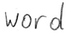

# Распознавание рукописного текста с помощью TensorFlow


Система распознавания рукописного текста (HTR), реализованная с помощью TensorFlow (TF) и обученная на базе автономного набора данных HTR I AM.
Модель принимает ** изображения отдельных слов или текстовых строк (нескольких слов) в качестве входных данных  и выводит распознанный текст .
3/4 слов из набора проверки распознаны правильно, а частота ошибок символов составляет около 10%.


## Запук демо-версию

* * Загрузите одну из предварительно обученных моделей
* [Модель, обученная на словесных изображениях](https://www.dropbox.com/s/mya8hw6jyzqm0a3/word-model.zip?dl=1 ):
обрабатывает только отдельные слова для каждого изображения, но дает лучшие результаты в наборе данных IAM word
* [Модель, обученная на изображениях текстовых строк](https://www.dropbox.com/s/7xwkcilho10rthn/line-model.zip?dl=1 ):
может обрабатывать несколько слов в одном изображении
* Поместите содержимое загруженного zip-файла в каталог `model` репозитория
* Перейдите в каталог `src`
* Запустите код вывода:
* Выполнить `python main.py ` чтобы запустить модель на изображении слова
* Выполнить `python main.py --img_file ../data/line.png` для запуска модели на изображении текстовой строки

Входные изображения и ожидаемые выходные данные показаны ниже при использовании модели текстовых строк.


```
> python main.py
Init with stored values from ../model/snapshot-13
Recognized: "word"
Probability: 0.9806370139122009
```


```
> python main.py --img_file ../data/line.png
Init with stored values from ../model/snapshot-13
Recognized: "or work on line level"
Probability: 0.6674373149871826
```

## Аргументы командной строки
* `--mode`: select between "train", "validate" and "infer". Defaults to "infer".
* `--decoder`: select from CTC decoders "bestpath", "beamsearch" and "wordbeamsearch". Defaults to "bestpath". For option "wordbeamsearch" see details below.
* `--batch_size`: batch size.
* `--data_dir`: directory containing IAM dataset (with subdirectories `img` and `gt`).
* `--fast`: use LMDB to load images faster.
* `--line_mode`: train reading text lines instead of single words.
* `--img_file`: image that is used for inference.
* `--dump`: dumps the output of the NN to CSV file(s) saved in the `dump` folder. Can be used as input for the [CTCDecoder](https://github.com/githubharald/CTCDecoder).

## Интегрируйте декодирование поиска по лучу слова
[Декодер поиска по словесному лучу](https://repositum.tuwien.ac.at/obvutwoa/download/pdf/2774578 ) может использоваться вместо двух декодеров, поставляемых с TF.
Слова ограничены теми, которые содержатся в словаре, но произвольные строки символов, не состоящие из слов (цифры, знаки препинания), все еще могут быть распознаны.
На следующем рисунке показан образец, для которого word beam search способен распознать правильный текст, в то время как другие декодеры терпят неудачу.


Следуйте этим инструкциям, чтобы интегрировать декодирование поиска по word beam:

1. Клонировать репозиторий [CTCWordBeamSearch](https://github.com/githubharald/CTCWordBeamSearch )
2. Скомпилируйте и установите, запустив `pip install .` на корневом уровне репозитория CTCWordBeamSearch
3. Укажите параметр командной строки `--поиск по лучу слова декодера` при выполнении `main.py ` чтобы на самом деле использовать декодер

Словарь автоматически создается в режиме обучения и проверки с использованием всех слов, содержащихся в наборе данных IAM (т.е. также включая слова из набора проверки), и сохраняется в файл `data/corpus.txt `.
Далее, созданный вручную список слов-символов можно найти в файле `model/wordCharList.txt `.
Ширина луча установлена равной 50, чтобы соответствовать ширине луча при декодировании поиска по ванильному лучу.

## Обучающая модель на наборе данных IAM

### Подготовить набор данных
Следуйте этим инструкциям, чтобы получить набор данных IAM:

* * Зарегистрируйтесь бесплатно на этом [веб-сайте](http://www.fk.inf.unibe.ch/databases/iam-handwriting-database )
* Скачать `words/words.tgz`
* Скачать `ascii/words.txt `
* Создайте каталог для набора данных на вашем диске и создайте два подкаталога: `img` и `gt`
* Положить `words.txt ` в каталог `gt`
* Поместите содержимое (каталоги `a01`, `a02`, ...) `words.tgz` в каталог `img`.

### Тренировка бега

* Удалите файлы из каталога "модель", если вы хотите тренироваться с нуля
* * Перейдите в каталог `src` и запустите `python main.py --model train --data_dir path/to/I AM`
* Набор данных IAM разделен на 95% обучающих данных и 5% проверочных данных  
* Если указана опция `--line_mode`,
модель обучается на изображениях текстовых строк, созданных путем объединения нескольких изображений word в одно  
* Обучение прекращается после фиксированного количества эпох без улучшения

Предварительно обученная модель word была обучена с помощью этой команды на GTX 1050 Ti:
```
python main.py --mode train --fast --data_dir path/to/iam  --batch_size 500 --early_stopping 15
```

И линейная модель с:
```
python main.py --mode train --fast --data_dir path/to/iam  --batch_size 250 --early_stopping 10
```


### Быстрая загрузка изображений
Загрузка и декодирование файлов изображений png с диска является узким местом даже при использовании только небольшого графического процессора.
База данных IMDB используется для ускорения загрузки изображений:
* * Перейдите в каталог `src` и запустите `create_lmdb.py --data_dir path/to/yaml` с указанным каталогом данных IAM
* * В каталоге данных IAM, содержащем файлы LMDB, создается подпапка `imdb`
* При обучении модели добавьте параметр командной строки `--fast`

Набор данных должен располагаться на твердотельном накопителе.
Использование опции `--fast` и GTX 1050 Ti для обучения отдельным словам занимает около 3 часов при размере пакета 500.
Обучение работе с текстовыми строками занимает немного больше времени.


## Информация о модели

Модель представляет собой урезанную версию системы HTR, которую я внедрил для [моей диссертации]((https://repositum.tuwien.ac.at/obvutwhs/download/pdf/2874742 )).
Остается лишь минимум для распознавания текста с приемлемой точностью.
Он состоит из 5 слоев CNN, 2 слоев RNN (LSTM) и слоя потери и декодирования CTC.
Для получения более подробной информации смотрите эту [статью Medium](https://towards данные science.com/2326a3487cd5 ).


## References
* [Build a Handwritten Text Recognition System using TensorFlow](https://towardsdatascience.com/2326a3487cd5)
* [Scheidl - Handwritten Text Recognition in Historical Documents](https://repositum.tuwien.ac.at/obvutwhs/download/pdf/2874742)
* [Scheidl - Word Beam Search: A Connectionist Temporal Classification Decoding Algorithm](https://repositum.tuwien.ac.at/obvutwoa/download/pdf/2774578)

